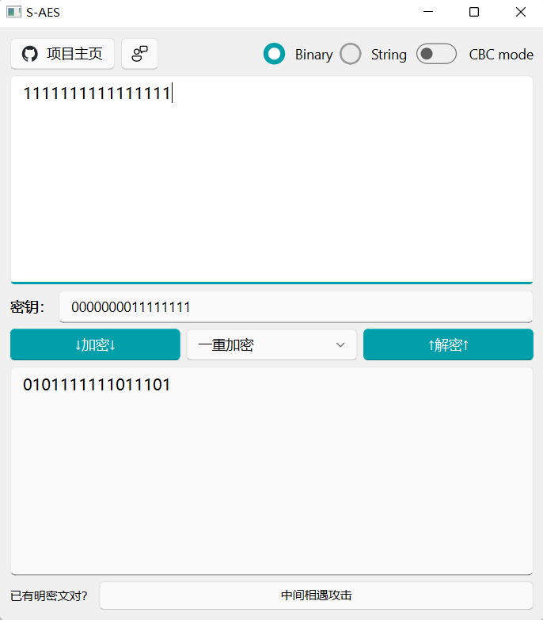
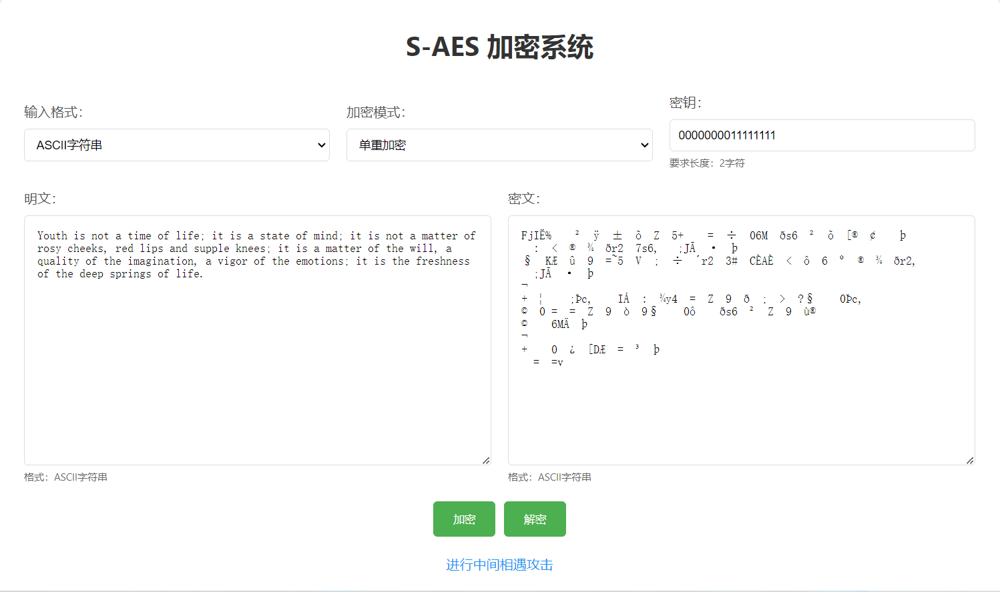
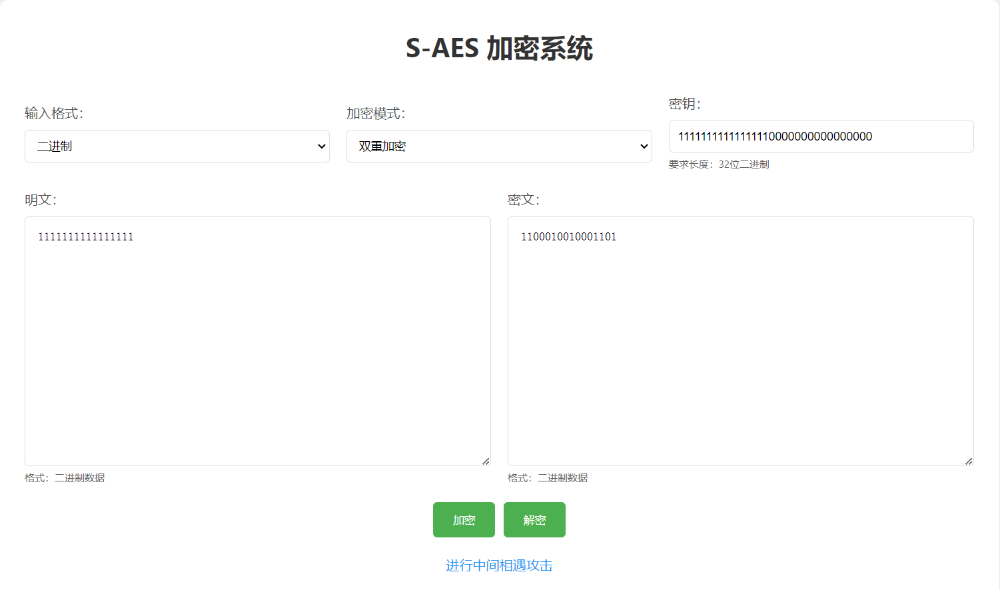
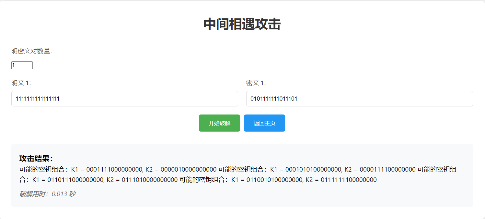
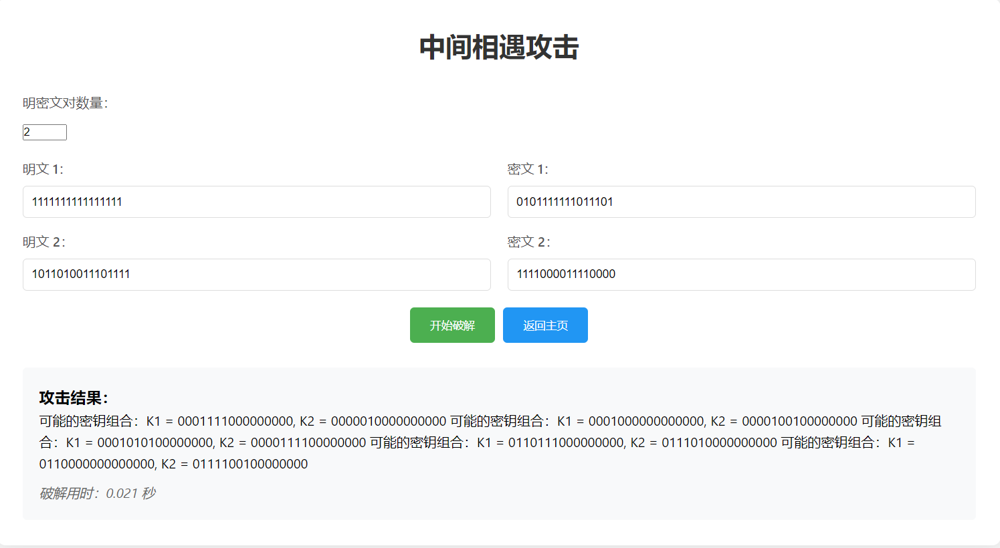
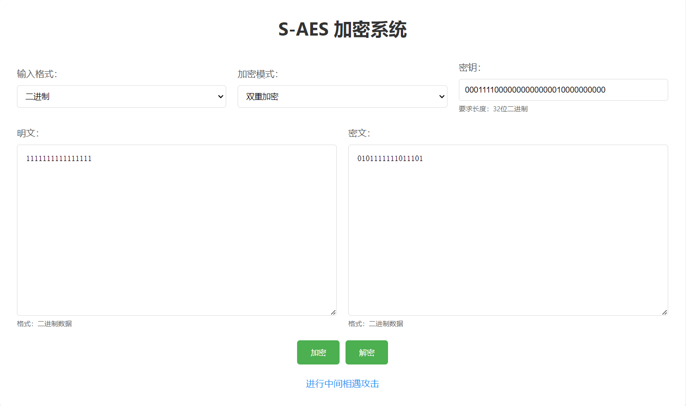

# 测试情况

## 1 作业概述

本次作业根据"信息安全导论"课程第8-9次课讲述的AES算法，在课外认真阅读教科书附录D：S-AES的内容，学习了解S-AES算法，以及所学知识的基础上，使用Python+QT来编程实现加密解密、暴力破解算法，以及后续的闯关测试，并设计了一个用户友好的GUI界面。

## 2 闯关测试

### 2.1 第1关：**基本测试**

​       根据S-AES算法编写和调试程序，提供GUI解密支持用户交互。输入可以是16bit的数据和16bit的密钥，输出是16bit的密文。

GUI用户交互界面：

使用一对明密文对进行加/解密操作，密钥为0000000011111111：

测试结果：点击加密按钮和解密按钮结果均如上图所示完成，测试通过。

### 2.2 第2关：交叉测试

​	考虑到是"算法标准"，所有人在编写程序的时候需要使用相同算法流程和转换单元(替换盒、列混淆矩阵等)，以保证算法和程序在异构的系统或平台上都可以正常运行。设有A和B两组位同学(选择相同的密钥K)；则A、B组同学编写的程序对明文P进行加密得到相同的密文C；或者B组同学接收到A组程序加密的密文C，使用B组程序进行解密可得到与A相同的P。

 我们与学长(https://github.com/Loche2/S-AES_Python)进行交叉测试，双方采用相同的密钥0000000011111111对明文1111111111111111进行加密：

我们的结果：

学长的结果：

测试结果：结果相同，测试通过。

### 2.3 第3关：拓展功能

考虑到向实用性扩展，加密算法的数据输入可以是ASII编码字符串(分组为2 Bytes)，对应地输出也可以是ACII字符串(很可能是乱码)。程序设计了使用字符串的形式进行输入和输出的模式，只需要切换到ASCII字符串模式即可将字符串加密或将密文（字符串形式）解密为明文字符串：

测试结果：如图，成功对一段英文进行了S-AES加密，测试通过。

### 2.4 第4关：多重加密

#### 2.4.1 双重加密

​	将S-AES算法通过双重加密进行扩展，分组长度仍然是16 bits，但密钥长度为32 bits。

测试结果：如图，成功使用32bits密钥进行双重加密。

#### 2.4.2 中间相遇攻击

​	假设找到了使用相同密钥的明、密文对(一个或多个)，请尝试使用中间相遇攻击的方法找到正确的密钥Key(K1+K2)。

单个明密文对：

多个明密文对：

破解验证：

测试结果：输入明密文对后，点击暴力破解按钮，能够通过中间相遇工具得到所有可能的密钥对。

#### 2.4.3 三重加密

​	将S-AES算法通过三重加密进行扩展，使用48bits(K1+K2+K3)的模式进行三重加解密。

### 2.5 第5关：工作模式

基于S-AES算法，使用密码分组链(CBC)模式对较长的明文消息进行加密。注意初始向量(16 bits) 的生成，并需要加解密双方共享。在CBC模式下进行加密，并尝试对密文分组进行替换或修改，然后进行解密，请对比篡改密文前后的解密结果。

CBC模式加解密：

修改密文（将密文中2替换为3）后解密：

测试结果：发现解密后明文完全发生改变。
